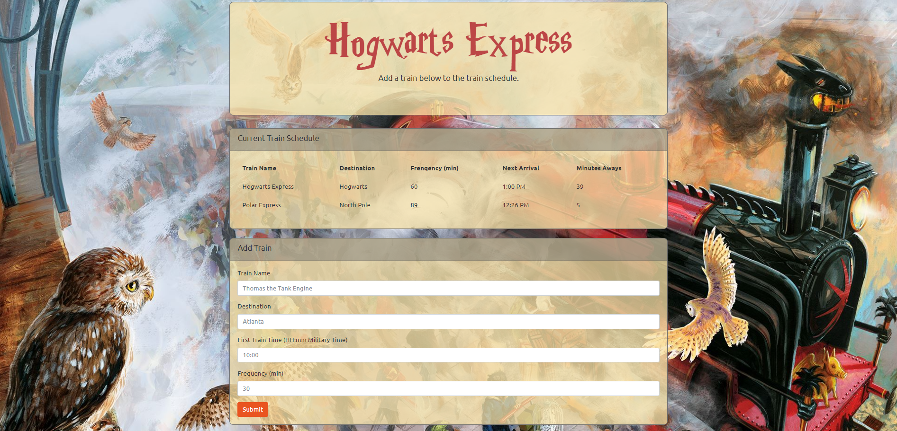

# Train-Scheduler

**Creator**: `Scott Ladd`

**Created on**: `Oct 4th 2019`

- - -

## ABOUT THE APP
A train schedule application that incorporates Firebase to host arrival and departure data. This app also retrieves and manipulates this information with Moment.js. The website provides up-to-date information about various trains, namely their arrival times and how many minutes remain until they arrive at their station.

## HOW TO USE THE APP
Fill out the form at the bottom of the page and hit submit. Enjoy!

- - -

## Deployed Site

[Click Here](https://scottjr101.github.io/Train-Scheduler/)

- - -

## TECHNOLOGIES USED
* Javascript
* CSS
* HTML
* Moment.js
* Firebase
* BootStrap
* Git
* GitHub